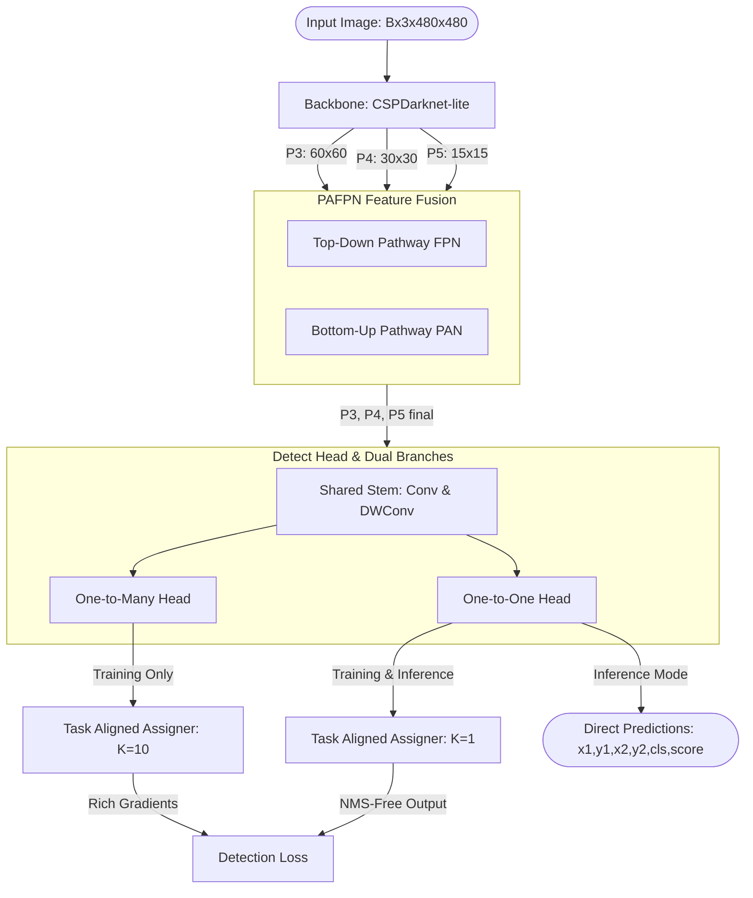

# YOLOv10-Lite: PyTorch Implementation & Architecture Analysis

Dự án này là phiên bản rút gọn (Lite) của kiến trúc mạng phát hiện vật thể tiên tiến nhất hiện nay — **YOLOv10** — được triển khai trực tiếp bằng PyTorch. Mục tiêu cốt lõi của dự án là hiện thực hóa cơ chế **Dual Label Assignment (Gán nhãn kép)** của YOLOv10 để loại bỏ hoàn toàn bộ lọc **NMS (Non-Maximum Suppression)** khi suy luận (inference), qua đó giảm thiểu tối đa độ trễ (latency) nhưng vẫn giữ được độ chính xác nhờ sự giám sát phong phú từ nhánh phụ trong quá trình huấn luyện.

Tài liệu này cung cấp phân tích chi tiết, toàn diện về kiến trúc hệ thống, cấu trúc thư mục, toán học của các hàm Loss, cơ chế hoạt động của bộ DataLoader/Augmentation và hướng dẫn chạy pipeline.

---

## 📂 1. Cấu Trúc Chi Tiết Thư Mục Dự Án

Cấu trúc mã nguồn hiện tại của dự án:

```text
CNNModel/
├── Documents/
│   └── YoloV10.pdf          # Paper nghiên cứu YOLOv10 gốc
├── src/
│   ├── blocks.py            # Các khối mạng cơ bản (Conv, DWConv, C2f, SPPF, DFL)
│   ├── backbone_neck.py     # CSPDarknet Backbone & PAFPN Neck dung hợp đặc trưng
│   ├── head.py              # Decoupled Head chứa nhánh dự đoán o2o và o2m
│   ├── model.py             # Lớp mạng Detector hoàn chỉnh (NMS-Free Detector & Trunk utility)
│   ├── dataset.py           # Bộ đọc dữ liệu YOLOv10Dataset, letterbox & collate_fn
│   ├── config.py            # Các tham số cấu hình huấn luyện (TrainConfig)
│   ├── training.py          # Script chạy huấn luyện chính từ CLI
│   ├── test_pipeline.py     # Script kiểm thử nhanh pipeline huấn luyện/suy luận trên dữ liệu giả lập
│   ├── training_pipeline.md # Tài liệu hướng dẫn thiết kế & huấn luyện nâng cao
│   ├── checkpoint/          # Thư mục chứa các checkpoint trong quá trình huấn luyện
│   └── train/
│       ├── loss.py          # Hàm Loss (BCE, CIoU, DFL) & Task Aligned Assigner
│       ├── ema.py           # Bộ Exponential Moving Average lưu tham số ổn định
│       └── engine.py        # Công cụ thực thi huấn luyện (Trining & Validation engine)
└── README.md                # Tài liệu phân tích chi tiết này
```

---

## 🏗️ 2. Phân Tích Kiến Trúc Hệ Thống (Architecture Analysis)

Kiến trúc YOLOv10-Lite bao gồm 3 thành phần chính: **Backbone**, **Neck**, và **Head** kết hợp với cơ chế gán nhãn kép song song:



### 🔹 2.1. Backbone: CSPDarknet-Lite ([backbone_neck.py](file:///home/tranmanhduy/Workspace/ptithcm/TTTN/CNNModel/src/backbone_neck.py))
Trích xuất đặc trưng đa quy mô với kích thước ảnh đầu vào mặc định là $480 \times 480$ pixel:
*   **Stem**: Lớp Convolution đầu tiên giảm kích thước ảnh xuống $240 \times 240$ với kernel $3\times3$ và stride 2.
*   **Stages (1 đến 4)**: Mỗi stage chứa một Conv Layer stride 2 để hạ độ phân giải không gian đi một nửa, tiếp nối bởi khối **C2f** để trích xuất đặc trưng sâu hơn.
*   **SPPF (Spatial Pyramid Pooling Fast)**: Đặt ở cuối Stage 4 (tại level P5) giúp mở rộng receptive field mà không làm tăng đáng kể chi phí tính toán bằng cách concatenate các output của MaxPool với kích thước kernel khác nhau ($5\times5, 9\times9, 13\times13$).
*   **Các đầu ra đa quy mô (Multi-scale)**:
    *   **P3**: Kích thước $60 \times 60$, chứa thông tin biên mịn và vị trí tốt (phù hợp vật thể nhỏ).
    *   **P4**: Kích thước $30 \times 30$, độ phân giải trung bình.
    *   **P5**: Kích thước $15 \times 15$, chứa đặc trưng ngữ nghĩa mức cao (phù hợp vật thể lớn).

### 🔹 2.2. Neck: PAFPN ([backbone_neck.py](file:///home/tranmanhduy/Workspace/ptithcm/TTTN/CNNModel/src/backbone_neck.py))
Neck sử dụng cấu trúc **Path Aggregation Network (PANet / PAFPN)** để dung hợp các tầng đặc trưng:
*   **Đường đi Top-Down (FPN)**: Truyền thông tin ngữ nghĩa mạnh từ các layer sâu (P5) xuống các layer nông (P3) bằng cách upsample và concatenate.
*   **Đường đi Bottom-Up (PAN)**: Truyền thông tin định vị chính xác ngược từ các layer nông (P3) lên các layer sâu (P5) bằng cách downsample và concatenate.
*   Quá trình dung hợp đặc trưng này giúp các đặc trưng đầu ra tại P3, P4, P5 vừa giàu thông tin ngữ nghĩa (semantic) vừa chính xác về vị trí không gian (spatial).

### 🔹 2.3. Head: Decoupled Head với Dual Label Assignment ([head.py](file:///home/tranmanhduy/Workspace/ptithcm/TTTN/CNNModel/src/head.py))
Đây là cải tiến cốt lõi của YOLOv10. Trong các phiên bản YOLO trước (YOLOv8, YOLOv9), đầu dự đoán (Head) sử dụng cơ chế **One-to-Many**: gán nhiều anchor tích cực (positive anchors) cho một đối tượng thật (ground truth). Điều này bắt buộc phải sử dụng **NMS** khi suy luận (inference) để lọc bỏ các box trùng lặp.

YOLOv10 giải quyết vấn đề này bằng cách thiết kế **Decoupled Head kép**:
*   **Shared Stem**: Nhánh phân loại (Classification) và nhánh hồi quy (Regression) đi qua các lớp trích xuất đặc trưng riêng biệt nhưng dùng chung cho cả hai nhánh dự đoán o2o và o2m.
    *   **Cls Stem**: Sử dụng **Depthwise Separable Convolutions (DWConv)** để giảm tham số đầu phân loại mà vẫn giữ được độ sâu.
    *   **Reg Stem**: Sử dụng **Conv** tiêu chuẩn giúp giữ lại độ chính xác cao hơn cho nhiệm vụ hồi quy biên.
*   **Nhánh One-to-Many (o2m)**:
    *   Sử dụng $1 \times 1$ Conv riêng để xuất ra phân loại (`cls_o2m`) và tọa độ (`reg_o2m`).
    *   Khi train, sử dụng **Task Aligned Assigner** với $K = 10$. Nhánh này tối ưu hóa khả năng học biểu diễn đặc trưng phong phú cho backbone và neck.
*   **Nhánh One-to-One (o2o)**:
    *   Sử dụng một $1 \times 1$ Conv độc lập khác để xuất ra phân loại (`cls_o2o`) và tọa độ (`reg_o2o`).
    *   Khi train, sử dụng **Task Aligned Assigner** với $K = 1$. Nhánh này ép mô hình chỉ được chọn **duy nhất một predictor tối ưu** cho mỗi ground truth, loại bỏ sự dư thừa.
    *   **Khi suy luận (Inference)**: Chỉ sử dụng nhánh o2o. Do nhánh này đã được huấn luyện để chỉ dự đoán 1 box duy nhất cho mỗi đối tượng, ta có thể bỏ hoàn toàn thuật toán NMS.

---

## 📐 3. Chi Tiết Các Cơ Chế Toán Học & Thuật Toán Gán Nhãn ([loss.py](file:///home/tranmanhduy/Workspace/ptithcm/TTTN/CNNModel/src/train/loss.py))

### 🔹 3.1. Task Aligned Assigner (TAA)
Để chọn ra các anchor tốt nhất gán cho ground truth, hệ thống sử dụng một metric tích hợp mức độ phân loại và độ khớp bounding box (Alignment Metric $t$):

$$t = s^\alpha \times \text{IoU}^\beta$$

Trong đó:
*   $s$: Điểm số phân loại của anchor đối với class của ground truth đó.
*   $\text{IoU}$: Chỉ số Intersection over Union giữa bounding box dự đoán của anchor và ground truth.
*   $\alpha$ (mặc định = 0.5) và $\beta$ (mặc định = 6.0): Các siêu tham số điều phối trọng số của phân loại và định vị.

**Thuật toán thực hiện:**
1.  Lọc các anchor nằm bên trong bounding box vật thể thực tế (Ground Truth) dựa trên tọa độ tâm.
2.  Tính điểm số alignment $t$ cho tất cả các anchor hợp lệ.
3.  Với mỗi Ground Truth:
    *   **Ở nhánh o2m**: Chọn ra $K = 10$ anchors có điểm $t$ cao nhất làm mẫu tích cực (positive samples).
    *   **Ở nhánh o2o**: Chọn ra duy nhất $K = 1$ anchor có điểm $t$ cao nhất làm mẫu tích cực.
4.  Nếu 1 anchor bị tranh chấp bởi nhiều Ground Truth, anchor đó sẽ được gán cho Ground Truth nào mang lại giá trị alignment $t$ lớn nhất.

### 🔹 3.2. Hồi Quy Bounding Box qua Distribution Focal Loss (DFL)
Thay vì dự đoán trực tiếp 4 tọa độ dạng trị số liên tục ($x_1, y_1, x_2, y_2$), mô hình dự đoán một phân phối xác suất rời rạc cho khoảng cách từ tâm anchor tới 4 cạnh biên (Left, Top, Right, Bottom - ltrb).
*   Với mỗi cạnh biên, mô hình dự đoán một vector chứa `reg_max` logits (mặc định = 16).
*   Vector logits này được đưa qua hàm Softmax để thu được phân phối xác suất $P = [p_0, p_1, \dots, p_{reg\_max-1}]$.
*   Tọa độ liên tục được giải mã bằng kỳ vọng toán học:

$$\hat{y} = \sum_{i=0}^{reg\_max-1} i \times p_i$$

Mô hình học phân phối này thông qua hàm **Distribution Focal Loss**:

$$L_{DFL}(P_i, P_{i+1}) = - \left( (y_{i+1} - y)\log(P_i) + (y - y_i)\log(P_{i+1}) \right)$$

Trong đó $y_i = \lfloor y \rfloor$ và $y_{i+1} = y_i + 1$ là hai mốc nguyên kề cận giá trị ground truth liên tục $y$.

### 🔹 3.3. Complete IoU (CIoU) Loss
Hàm loss hồi quy bounding box chính sử dụng CIoU Loss, cải tiến từ IoU bằng cách phạt thêm khoảng cách tâm và sai khác tỷ lệ khung hình:

$$L_{CIoU} = 1 - \text{IoU} + \frac{\rho^2(b, b^{gt})}{c^2} + \alpha v$$

Trong đó:
*   $\rho^2(b, b^{gt})$: Khoảng cách Euclidean giữa tâm của box dự đoán và ground truth.
*   $c$: Đường chéo của box nhỏ nhất bao quanh cả hai box.
*   $v = \frac{4}{\pi^2} \left( \arctan\frac{w^{gt}}{h^{gt}} - \arctan\frac{w}{h} \right)^2$ đo lường sự không nhất quán của tỷ lệ khung hình.
*   $\alpha = \frac{v}{(1 - \text{IoU}) + v}$ là tham số điều phối.

---

## 🛠️ 4. Thiết Kế & Hiện Thực Bộ Dataloader ([dataset.py](file:///home/tranmanhduy/Workspace/ptithcm/TTTN/CNNModel/src/dataset.py))

Lớp [YOLOv10Dataset](file:///home/tranmanhduy/Workspace/ptithcm/TTTN/CNNModel/src/dataset.py#L28) được xây dựng để load ảnh từ hệ thống tệp và xử lý nhãn dạng JSON Lines (JSONL).

### 🔹 4.1. Cấu Trúc Dữ Liệu
Thư mục chứa dữ liệu có cấu trúc như sau:
*   **Images/**: Chứa các tệp ảnh `.jpg` gốc.
*   **annotations.jsonl**: Tệp JSON Lines, mỗi dòng mô tả các đối tượng trong 1 ảnh:
    ```json
    {"image_name": "img1.jpg", "object": [{"x1": 50, "y1": 50, "x2": 150, "y2": 200, "id_class": 0}]}
    ```
*   **classes.jsonl**: Tệp JSON Lines định nghĩa ánh xạ class ID thành tên nhãn:
    ```json
    {"id": 0, "name_class": "person"}
    ```

### 🔹 4.2. Xử lý Ảnh & Letterbox
Thay vì resize trực tiếp làm méo ảnh gốc, Dataloader áp dụng hàm `letterbox` giúp giữ nguyên tỷ lệ khung hình của ảnh:
1.  Ảnh gốc kích thước $(W_{orig}, H_{orig})$ được resize về kích thước mới $(W_{new}, H_{new})$ sao cho giữ nguyên tỷ lệ và không vượt quá $480 \times 480$.
2.  Tạo canvas màu xám trung tính $(114, 114, 114)$ kích thước $480 \times 480$.
3.  Dán ảnh đã resize vào chính giữa canvas, tính toán lượng padding ở 2 rìa là `pad_x` và `pad_y`.
4.  Mọi bounding box cũng được ánh xạ lại tọa độ sang hệ tọa độ mới qua công thức:

$$\text{scale} = \min\left(\frac{480}{W_{orig}}, \frac{480}{H_{orig}}\right)$$

$$x_{new} = x_{orig} \times \text{scale} + \text{pad}_x$$

$$y_{new} = y_{orig} \times \text{scale} + \text{pad}_y$$

### 🔹 4.3. Data Augmentation (Chỉ tập Train)
Để tăng độ đa dạng cho dữ liệu pretrain:
*   **Horizontal Flip**: Lật ngang ảnh ngẫu nhiên ($p=0.5$). Tọa độ bounding box cũng được biến đổi ngược lại: $x_{1\_new} = 480 - x_{2\_old}$, $x_{2\_new} = 480 - x_{1\_old}$.
*   **Color Jitter**: Thay đổi ngẫu nhiên độ sáng (brightness), độ tương phản (contrast), và độ bão hòa màu (saturation) trong khoảng $[-0.3, 0.3]$ với xác suất $p=0.5$.

### 🔹 4.4. Đóng Gói Lô Động (`collate_fn`)
Do mỗi ảnh chứa số lượng vật thể khác nhau, hàm `collate_fn` thực hiện việc đệm (padding) bounding box của các ảnh trong một Batch về cùng số lượng vật thể lớn nhất (`max_objs`):
*   `gt_boxes`: Đệm thêm các box có tọa độ `[0, 0, 0, 0]` để đạt kích thước `(B, max_objs, 4)`.
*   `gt_labels`: Đệm thêm nhãn `0` để đạt kích thước `(B, max_objs)`.
*   `gt_mask`: Trả về một Tensor Boolean kích thước `(B, max_objs)`. Các vị trí có vật thể thực sẽ mang giá trị `True`, vị trí được đệm mang giá trị `False` nhằm loại bỏ khỏi quá trình tính Loss.

---

## ⚡ 5. Các Tính Năng Đổi Head & Quản Lý Checkpoint

Để hỗ trợ việc pretrain Backbone và Neck rồi chuyển giao sang các bài toán mục tiêu khác nhau (downstream tasks), mô hình trong [model.py](file:///home/tranmanhduy/Workspace/ptithcm/TTTN/CNNModel/src/model.py) hỗ trợ các tính năng linh hoạt:
1.  **`trunk_state_dict()` / `save_trunk(path)`**: Chỉ trích xuất và lưu trữ trọng số của Backbone + Neck (Trunk) mà không bao gồm các trọng số của Detect Head cũ.
2.  **`load_trunk(path)`**: Nạp lại phần Trunk đã pretrain từ tệp checkpoint đã lưu.
3.  **`replace_head(nc, reg_max)`**: Hủy bỏ Detect Head cũ và khởi tạo một Head hoàn toàn mới tương thích với số lượng nhãn lớp mới (`nc`) hoặc tham số hồi quy mới (`reg_max`).
4.  **`freeze_trunk(freeze=True)`**: Đóng băng toàn bộ các tham số của Backbone + Neck. Tính năng này cực kỳ hữu dụng khi bạn muốn huấn luyện "ấm" (warm-up) Detect Head mới ở những epoch đầu tiên nhằm tránh phá vỡ các đặc trưng chung đã học được trên mạng Backbone/Neck trước đó.

---

## 🚀 6. Hướng Dẫn Cài Đặt & Thực Thi Huấn Luyện

### 🔹 6.1. Chuẩn bị môi trường
Yêu cầu Python 3.8+ và các thư viện hỗ trợ:
```bash
pip install torch Pillow numpy
```

### 🔹 6.2. Chạy thử nghiệm Pipeline giả lập
Thực thi kiểm tra huấn luyện và suy luận NMS-free ban đầu trên dữ liệu ngẫu nhiên để xác minh mô hình không bị lỗi cấu trúc:
```bash
python3 src/test_pipeline.py
```

### 🔹 6.3. Chạy Huấn Luyện Chính Thức
Thực thi huấn luyện mạng trên bộ dữ liệu thực tế bằng cách gọi tệp [training.py](file:///home/tranmanhduy/Workspace/ptithcm/TTTN/CNNModel/src/training.py):
```bash
python3 src/training.py \
  --data_dir ./data \
  --nc 80 \
  --epochs 150 \
  --batch_size 16 \
  --img_size 480 \
  --device cuda \
  --ckpt_dir ./checkpoints
```

**Các siêu tham số huấn luyện mặc định:**
*   **LR Schedule**: Linear Warmup trong 3 epoch đầu tiên, sau đó áp dụng giảm dần theo hàm Cosine (Cosine Decay) về hệ số tối thiểu $0.01 \times \text{lr}_0$.
*   **Optimization**: Sử dụng AdamW mặc định, tự động tách các tham số bias và BatchNorm ra khỏi quá trình phân rã trọng số (weight decay) để tránh suy giảm hiệu suất.
*   **EMA (Exponential Moving Average)**: Tự động kích hoạt bộ lưu trữ EMA để theo dõi trọng số trung bình động, giúp đánh giá tập Validation và lưu checkpoint tối ưu (`best.pt`) ổn định hơn.
*   **AMP (Automatic Mixed Precision)**: Kích hoạt chế độ huấn luyện dấu phẩy động hỗn hợp tự động (Float16/Float32) khi phát hiện thiết bị GPU CUDA để tăng tốc độ huấn luyện.
