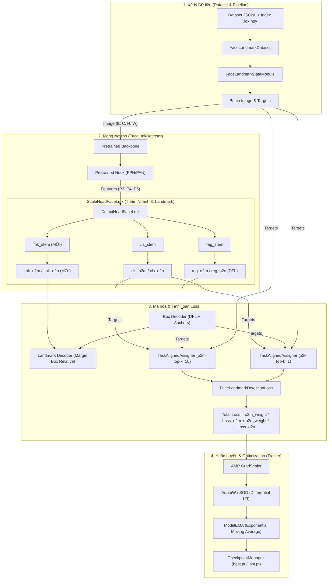

# Phân Tích Kiến Trúc Module Transfer Learning (`Face & Landmark Detection`)

Tài liệu này phân tích chi tiết tổng quan kiến trúc, sơ đồ luồng dữ liệu, so sánh điểm cải tiến so với HEAD YOLOv10 gốc và vai trò từng thành phần trong thư mục [`transferLearning`](file:///home/tranmanhduy/Workspace/ptithcm/TTTN/CNNModel/src/transferLearning).

---

## 1. Tổng Quan Kiến Trúc & Cải Tiến So Với YOLOv10 Gốc

Module [`transferLearning`](file:///home/tranmanhduy/Workspace/ptithcm/TTTN/CNNModel/src/transferLearning) xây dựng một hệ thống **Transfer Learning đa nhiệm (Multi-task Learning)** nhằm **Phát hiện khuôn mặt (Face Bounding Box)** đồng thời **Dự đoán tọa độ Landmark khuôn mặt (ví dụ: 478 điểm)** trên cùng một mạng sinh đặc trưng (Backbone + Neck).

### 💡 So sánh HEAD YOLOv10 gốc vs HEAD Transfer Learning (`ScaleHeadFaceLmk`):

| Đặc điểm | HEAD YOLOv10 Gốc | HEAD Transfer Learning Face + Landmark |
| :--- | :--- | :--- |
| **Số nhánh xuất ra (per scale)** | **2 nhánh**: Classification (`cls`) & Bbox Regression (`reg`) | **3 nhánh**: Classification (`cls`), Bbox Regression (`reg`), & **Landmark Regression (`lmk`)** |
| **Cấu trúc Stem** | `cls_stem` & `reg_stem` | `cls_stem`, `reg_stem`, và **`lmk_stem`** |
| **Kênh đầu ra Landmark** | Không có | $K \times 2$ channels (với $K = \text{num\_landmarks}$, ví dụ $478 \times 2 = 956$ channels) |
| **Nhiệm vụ** | Chỉ phát hiện Bounding Box & Class Score | Phát hiện Bounding Box + Khôi phục lưới tọa độ Landmark chi tiết |

### 🛠️ Chi tiết kiến trúc kế thừa NMS-Free:
1. **Trunk Pretrained**: Tái sử dụng toàn bộ trọng số Backbone + Neck từ mạng phát hiện cơ sở ([`NMSFreeDetector`](file:///home/tranmanhduy/Workspace/ptithcm/TTTN/CNNModel/src/transferLearning/model_lmk.py#L158)).
2. **Multi-task Head**: Thay thế Head phát hiện 2 nhánh đơn thuần bằng [`DetectHeadFaceLmk`](file:///home/tranmanhduy/Workspace/ptithcm/TTTN/CNNModel/src/transferLearning/model_lmk.py#L70) tích hợp thêm nhánh thứ 3 (`lmk_stem` & `lmk_conv`) cho cả 2 đường Dual Assignment.
3. **Dual Assignment (o2m & o2o)**: Đào tạo đồng thời 2 đường song song:
   - **One-to-Many (`o2m`)**: Giúp mô hình học biểu diễn đặc trưng phong phú trong quá trình huấn luyện ($top\_k = 10$).
   - **One-to-One (`o2o`)**: Phục vụ suy luận trực tiếp NMS-Free không cần qua bước loại bỏ trùng lặp NMS ($top\_k = 1$).

---

## 2. Sơ Đồ Luồng Dữ Liệu & Kiến Trúc (Mermaid Diagram)

---

## 3. Phân Tích Chi Tiết Các Thành Phần (Components Analysis)

Thư mục gồm **5 file Python chính**:

### 3.1 [`config_lmk.py`](file:///home/tranmanhduy/Workspace/ptithcm/TTTN/CNNModel/src/transferLearning/config_lmk.py) — Quản lý Cấu hình System
Chứa các lớp dataclass định nghĩa toàn bộ siêu tham số (hyperparameters):
- **[`FaceLmkConfig`](file:///home/tranmanhduy/Workspace/ptithcm/TTTN/CNNModel/src/transferLearning/config_lmk.py#L6)**: Cấu hình tham số mô hình & loss landmark:
  - `nc=1`: Số lớp phát hiện (1 class khuôn mặt).
  - `reg_max=16`: Phạm vi phân bố DFL (Distribution Focal Loss) cho bbox.
  - `strides=(8, 16, 32)`: Tỉ lệ giảm kích thước feature map tương ứng P3, P4, P5.
  - `lmk_margin=0.05`: Lề mở rộng khung bounding box khi mã hóa tọa độ landmark.
  - Các hệ số trọng số loss (`box_gain=7.5`, `cls_gain=0.5`, `dfl_gain=1.5`, `lmk_gain=2.0`).
  - Landmark mắt/iris và miệng có trọng số `3.0`; đỉnh mũi có trọng số `4.0`.
  - Cấu hình gán nhãn `topk_o2m=10`, `topk_o2o=1`, `alpha=0.5`, `beta=6.0`.
- **[`DatasetConfig`](file:///home/tranmanhduy/Workspace/ptithcm/TTTN/CNNModel/src/transferLearning/config_lmk.py#L40)**: Được tạo từ một `TrainConfig` duy nhất; mỗi split trỏ tới root chứa `images/` và `merged_faces.jsonl`, với kích thước ảnh thống nhất `480`.
- **[`MarginCoverageConfig`](file:///home/tranmanhduy/Workspace/ptithcm/TTTN/CNNModel/src/transferLearning/config_lmk.py#L52)**: Tham số khảo sát tỉ lệ lề landmark vượt quá bounding box.
- **[`TrainConfig`](file:///home/tranmanhduy/Workspace/ptithcm/TTTN/CNNModel/src/transferLearning/config_lmk.py)**: Định nghĩa kế hoạch hai giai đoạn: stage 1 đóng băng hoàn toàn trunk và chỉ train head; stage 2 mở khóa toàn mạng với LR backbone/neck nhỏ hơn LR head. Mỗi stage có số epoch, warmup và cosine decay độc lập.

---

### 3.2 [`dataset_lmk.py`](file:///home/tranmanhduy/Workspace/ptithcm/TTTN/CNNModel/src/transferLearning/dataset_lmk.py) — Quản Lý & Tiền Xử Lý Dữ Liệu
Cung cấp khả năng đọc file nhãn `.jsonl` dung lượng lớn một cách tối ưu:
- **Index Byte-Offset (`_build_or_load_offsets`)**: Tạo cache `.idx.npy` trong `index_cache_dir` (không ghi cạnh dataset) lưu vị trí byte của từng dòng JSONL. Giúp truy cập ngẫu nhiên $O(1)$ mà không nạp toàn bộ JSONL vào RAM.
- **Validation schema toàn tập**: Quét toàn bộ annotation, tự đồng bộ số landmark $K$, kiểm tra ảnh tồn tại, bbox/landmark hữu hạn và nằm trong miền tọa độ normalized đã cấu hình.
- **[`FaceLandmarkDataset`](file:///home/tranmanhduy/Workspace/ptithcm/TTTN/CNNModel/src/transferLearning/dataset_lmk.py#L46)**: Biến đổi tọa độ chuẩn hóa $[0, 1]$ sang không gian pixel $[0, S]$, chuyển đổi định dạng `boxes`, `labels`, `landmarks` và kiểm tra tính hợp lệ (`min_box_size_px`).
- **Horizontal flip có bảo toàn semantic**: chế độ `paired` tạo một mẫu gốc và một mẫu mirror cho mỗi record. Bbox được đổi theo `x1'=S-x2`, `x2'=S-x1`; 478 landmark đồng thời được hoán đổi index trái/phải theo topology canonical MediaPipe, bao gồm cả 10 điểm iris.
- **[`FaceLandmarkDataModule`](file:///home/tranmanhduy/Workspace/ptithcm/TTTN/CNNModel/src/transferLearning/dataset_lmk.py#L135)**: Bọc `Dataset` và `DataLoader` tối ưu hiệu năng với `pin_memory`, `persistent_workers`, và `prefetch_factor`.
- **[`LandmarkMarginCoverageChecker`](file:///home/tranmanhduy/Workspace/ptithcm/TTTN/CNNModel/src/transferLearning/dataset_lmk.py#L156)**: Công cụ phân tích thống kê tỉ lệ % điểm landmark rơi ngoài bbox ở các lề (`margin`) khác nhau nhằm chọn tham số `lmk_margin` chuẩn xác trên tập dữ liệu thực tế.

---

### 3.3 [`model_lmk.py`](file:///home/tranmanhduy/Workspace/ptithcm/TTTN/CNNModel/src/transferLearning/model_lmk.py) — Kiến Trúc Mạng Nơ-ron Đa Nhiệm
Định nghĩa mô hình phát hiện khuôn mặt và landmark:
- **[`ScaleHeadFaceLmk`](file:///home/tranmanhduy/Workspace/ptithcm/TTTN/CNNModel/src/transferLearning/model_lmk.py#L12)**: Đầu gán cho từng scale (P3, P4, P5). Chứa 2 đường dự đoán song song `o2m` và `o2o`, mỗi đường được mở rộng thành **3 nhánh tách biệt**:
  - `cls_stem` & `cls_o2m` / `cls_o2o`: Dự đoán xác suất phân lớp khuôn mặt.
  - `reg_stem` & `reg_o2m` / `reg_o2o`: Dự đoán vị trí bounding box theo dạng phân bố DFL ($4 \times reg\_max$).
  - **`lmk_stem` & `lmk_o2m` / `lmk_o2o` (Nhánh thứ 3 mới bổ sung)**: Gồm chuỗi các lớp Convolution (`Conv 3x3` -> `Conv 3x3` -> `Conv 1x1`) đưa kênh đặc trưng về `c_lmk_hidden` và cuối cùng xuất ra $K \times 2$ channels tương ứng với tọa độ $K$ điểm landmark.
- **[`DetectHeadFaceLmk`](file:///home/tranmanhduy/Workspace/ptithcm/TTTN/CNNModel/src/transferLearning/model_lmk.py#L70)**:
  - Tổng hợp đầu ra từ các scale, giải mã Bounding Box ([`decode_box`](file:///home/tranmanhduy/Workspace/ptithcm/TTTN/CNNModel/src/transferLearning/model_lmk.py#L98)) từ anchor points và DFL.
  - Giải mã tọa độ Landmark ([`decode_landmarks`](file:///home/tranmanhduy/Workspace/ptithcm/TTTN/CNNModel/src/transferLearning/model_lmk.py#L105)) theo vùng bbox mở rộng có hệ số margin:
    $$x_{1e} = x_1 - m \cdot w, \quad w_e = w \cdot (1 + 2m)$$
    $$x_{pixel} = x_{1e} + \text{sigmoid}(raw) \cdot w_e$$
- **[`FaceLmkDetector`](file:///home/tranmanhduy/Workspace/ptithcm/TTTN/CNNModel/src/transferLearning/model_lmk.py#L152)**: Mô hình hoàn chỉnh kết hợp Trunk (`backbone` + `neck`) từ `NMSFreeDetector` và `DetectHeadFaceLmk`. Hỗ trợ các hàm [`load_trunk`](file:///home/tranmanhduy/Workspace/ptithcm/TTTN/CNNModel/src/transferLearning/model_lmk.py#L167) để nạp trọng số pretrained và [`freeze_trunk`](file:///home/tranmanhduy/Workspace/ptithcm/TTTN/CNNModel/src/transferLearning/model_lmk.py#L180) để đóng băng/mở khóa trunk trong giai đoạn Fine-tuning.

---

### 3.4 [`loss_lmk.py`](file:///home/tranmanhduy/Workspace/ptithcm/TTTN/CNNModel/src/transferLearning/loss_lmk.py) — Hàm Mất Mát Multi-Task & Matcher
Định nghĩa hàm loss tổng hợp [`FaceLandmarkDetectionLoss`](file:///home/tranmanhduy/Workspace/ptithcm/TTTN/CNNModel/src/transferLearning/loss_lmk.py#L9):
- Sử dụng **`TaskAlignedAssigner`** cho cả 2 nhánh `o2m` ($top\_k=10$) và `o2o` ($top\_k=1$) để tự động gán nhãn anchor dựa trên sự kết hợp hài hòa giữa điểm tin cậy classification và độ khớp IoU của bbox.
- **Thành phần Loss trong từng nhánh (`_branch_loss`)**:
  1. `loss_cls`: BCE Loss tính trên điểm gán nhãn từ assigner.
  2. `loss_iou` & `loss_dfl`: Bbox IoU loss + Distribution Focal Loss thông qua `BboxLoss`.
  3. `loss_lmk` (Loss bổ sung): Smooth L1 Loss ($\beta = 0.05$) tính giữa tọa độ landmark dự đoán và tọa độ ground-truth đã được chuẩn hóa tương đối theo bbox mở rộng ([`_encode_landmark_targets`](file:///home/tranmanhduy/Workspace/ptithcm/TTTN/CNNModel/src/transferLearning/loss_lmk.py#L59)). Loss được nhân trọng số bù alignment (`weight_sel`).
- **Tổng Loss**:
  $$\mathcal{L}_{total} = w_{o2m} \cdot \mathcal{L}_{o2m} + w_{o2o} \cdot \mathcal{L}_{o2o}$$

---

### 3.5 [`train_lmk.py`](file:///home/tranmanhduy/Workspace/ptithcm/TTTN/CNNModel/src/transferLearning/train_lmk.py) — Điều Khiển Quá Trình Huấn Luyện (Trainer Pipeline)
Quản lý toàn bộ vòng đời huấn luyện mô hình:
- **[`Trainer`](file:///home/tranmanhduy/Workspace/ptithcm/TTTN/CNNModel/src/transferLearning/train_lmk.py#L92)**:
  - Khởi tạo thiết bị (`cuda`/`cpu`), cấu hình dữ liệu `FaceLandmarkDataModule`, tự động đồng bộ số landmark giữa dataset và config (`sync_num_landmarks`).
  - Nạp trọng số Pretrained Trunk (`load_trunk`).
  - **Chiến lược Fine-tuning 2 Giai đoạn**: Stage 1 đóng băng cả tham số lẫn BatchNorm của Backbone + Neck và chỉ huấn luyện Head. Stage 2 mở khóa toàn trunk, mặc định dùng `head_lr=3e-4` và `trunk_lr=3e-5`. Optimizer không bị dựng lại khi chuyển stage nên state của Head được giữ nguyên.
  - Tối ưu hóa: Khởi tạo AdamW / SGD, sử dụng Cosine Annealing LR scheduler với giai đoạn Warmup.
  - **Kỹ thuật Huấn luyện Tối ưu**:
    - `ModelEMA`: Duy trì bản sao Exponential Moving Average của trọng số mô hình giúp tăng độ ổn định khi suy luận.
    - Automatic Mixed Precision (`torch.amp.GradScaler`): Tăng tốc độ và giảm dung lượng VRAM GPU.
    - Gradient Clipping (`grad_clip_norm = 10.0`): Tránh bùng nổ gradient.
    - SummaryWriter (TensorBoard) & File Logger: Ghi nhận loss chi tiết (`o2m`, `o2o`, `cls`, `iou`, `dfl`, `lmk`), learning rate và dung lượng GPU RAM.
- **[`CheckpointManager`](file:///home/tranmanhduy/Workspace/ptithcm/TTTN/CNNModel/src/transferLearning/train_lmk.py#L54)**: Lưu/load state dict của model, optimizer, scaler, EMA, duy trì file `best.pt`, `last.pt` và giới hạn số lượng checkpoint gần nhất (`ckpt_keep_last`).

---

## 4. Các Kỹ Thuật Nổi Bật Trong Kiến Trúc

1. **Thêm Nhánh Landmark Độc Lập Trong Scale Head**:
   Khác với Head YOLOv10 chuẩn chỉ có 2 nhánh (`cls`, `reg`), kiến trúc Transfer Learning bổ sung nhánh thứ 3 (`lmk_stem`) hoạt động song song. Nhánh này có kênh ẩn `c_lmk_hidden` (tối đa 256) giúp trích xuất đặc trưng điểm mịn cho từng góc mặt.
2. **Hiệu năng I/O Dữ liệu vượt trội**:
   Nhờ cơ chế tạo index byte-offset `.idx.npy`, dataset có thể mở các file nhãn JSONL hàng chục GB mà không bị hiện tượng hụt bộ nhớ RAM hay chậm lag khi khởi tạo.
3. **Học đa nhiệm căn chỉnh mở rộng (Margin-based Landmark Encoding)**:
   Landmark khuôn mặt không chỉ bó hẹp bên trong bbox mà có thể vượt nhẹ ra ngoài (ví dụ cằm, tai, tóc). Việc sử dụng tham số `lmk_margin` kết hợp hàm chuẩn hóa mở rộng giúp mô hình dự đoán chính xác cả các điểm tiệm cận ranh giới bbox.
4. **Dual Assignment End-to-End (NMS-Free)**:
   Sự kết hợp giữa Supervision giàu thông tin ($top\_k=10$) ở nhánh `o2m` và khả năng suy luận trực tiếp 1-1 ($top\_k=1$) ở nhánh `o2o` loại bỏ hoàn toàn hậu xử lý NMS (Non-Maximum Suppression), giúp tăng tốc độ suy luận Real-time cực kỳ ấn tượng.
5. **Chiến thuật Transfer Learning bền vững**:
   Việc phân chia tốc độ học (Differential Learning Rate) giữa Trunk cũ và Head mới kết hợp chế độ Đóng băng linh hoạt (Freeze/Unfreeze) giúp mô hình tránh hiện tượng Quên thảm khốc (Catastrophic Forgetting).
