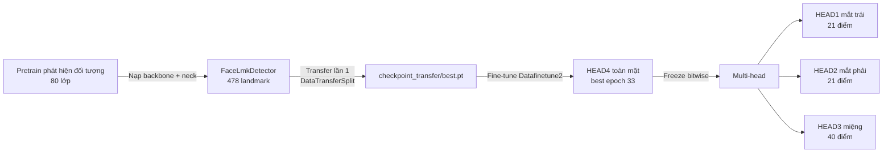

# BÁO CÁO KẾT QUẢ TRANSFER LEARNING CHO BÀI TOÁN FACE LANDMARK MULTI-HEAD

## 1. Mục tiêu và phạm vi báo cáo

Báo cáo này trình bày quá trình sử dụng mô hình CNN đã pretrain trên bài toán phát hiện đối tượng để transfer sang bài toán phát hiện khuôn mặt và định vị 478 landmark, sau đó huấn luyện thêm ba mạng chuyên biệt cho mắt trái, mắt phải và miệng. Mục tiêu cuối cùng là tạo ra các landmark đủ ổn định để tính các chỉ số phục vụ nhận biết buồn ngủ như EAR, MAR, PERCLOS và chuyển động đầu.

Kết quả pretrain được kế thừa từ [báo cáo đánh giá mô hình phát hiện đối tượng](../../../debugModel/bao_cao_danh_gia_mo_hinh.md). Kết quả transfer được khôi phục từ log huấn luyện, TensorBoard events và metadata lưu trực tiếp trong các checkpoint.

Báo cáo phân biệt rõ ba loại kết quả:

1. Hiệu năng phát hiện đối tượng của mô hình pretrain;
2. Loss của mô hình toàn mặt 478 landmark trong hai lượt transfer/fine-tune;
3. NME của ba specialist mắt và miệng trong mô hình multi-head.

Các chỉ số trên không cùng ý nghĩa và không được so sánh trực tiếp với nhau.

## 2. Nguồn dữ liệu và bằng chứng thực nghiệm

Các nguồn đã được kiểm tra gồm:

- `debugModel/bao_cao_danh_gia_mo_hinh.md`: kết quả mô hình phát hiện đối tượng trước transfer;
- `checkpoint_transfer/logs_face_lmk/face_lmk_train.log`: log văn bản của lượt transfer sang 478 landmark;
- `checkpoint_transfer/logs_face_lmk/face_lmk_train/**/events.out.tfevents.*`: dữ liệu TensorBoard;
- `checkpoint_transfer/best.pt`: checkpoint tốt nhất của lượt transfer đầu tiên;
- `checkpoints_face_lmk_finetune/*.pt`: checkpoint fine-tune toàn mặt trên `Datafinetune2`;
- `checkpoints_multihead/*.pt`: checkpoint và toàn bộ lịch sử metric của ba specialist;
- Mã nguồn trong `src/transferLearning` và `src/transferLearning/multiHead`.

Kết quả tìm kiếm cho thấy chỉ có log văn bản và TensorBoard của lượt transfer toàn mặt đầu tiên. Không tìm thấy file `.log` hoặc TensorBoard event riêng của lượt `face_lmk_finetune` và lượt `multi-head`. Tuy nhiên, checkpoint `multihead_final.pt` lưu đầy đủ `training_plan`, `stage_metrics`, thông tin dataset, cấu hình crop, trạng thái hoàn tất và metric từng epoch. Vì vậy, kết quả multi-head trong báo cáo được trích trực tiếp từ checkpoint này.

## 3. Chuỗi transfer learning

Quá trình transfer không nạp lại detection head 80 lớp. Log xác nhận 546 tensor của backbone và 372 tensor của neck được strict-load từ checkpoint `ft_step00091000.pt`; toàn bộ 918 tensor, tương ứng 18.779.744 phần tử, khớp chính xác. Head phát hiện đối tượng cũ bị bỏ qua và head mới cho bài toán một lớp khuôn mặt cùng 478 landmark được khởi tạo riêng.

Điều này có nghĩa là kết quả mAP của giai đoạn pretrain được dùng để đánh giá chất lượng representation ban đầu, không phải là kết quả trực tiếp của bài toán landmark.

## 4. Kết quả mô hình pretrain

Checkpoint nguồn `ft_step00091000.pt` được ghi nhận tại epoch 50, global step 91.000. Trên tập validation 80 lớp, mô hình đạt:

| Chỉ số | Kết quả |
|---|---:|
| mAP@0.50 | 0,5243 |
| mAP@0.75 | 0,3996 |
| mAP@0.50:0.95 | 0,3704 |
| Precision tại score 0,25 | 0,6900 |
| Recall tại score 0,25 | 0,5321 |

Mô hình pretrain đã học được các đặc trưng hình dạng và không gian có ý nghĩa, nhưng còn yếu với vật thể nhỏ. Trong bài toán landmark, mắt, iris và biên môi là các cấu trúc nhỏ; vì vậy kiến trúc multi-head sử dụng crop độ phân giải cao cho từng vùng thay vì chỉ tăng số epoch của head toàn mặt.

## 5. Transfer lần 1: từ detection sang 478 face landmark

### 5.1. Kiến trúc và cấu hình

Mô hình toàn mặt sử dụng `FaceLmkDetector` với một lớp khuôn mặt, 478 điểm MediaPipe và ba mức stride 8, 16, 32. Landmark được mã hóa theo `anchor_offset_grid_v1`. Head có 10.268.094 tham số, trong đó 10.268.078 tham số có thể học và 16 phần tử DFL được giữ cố định.

Quá trình huấn luyện gồm hai giai đoạn:

| Giai đoạn | Epoch dự kiến | Thành phần được học | Learning rate head | Learning rate trunk |
|---|---:|---|---:|---:|
| Stage 1: head only | 5 | Head landmark mới | $10^{-3}$ | 0 |
| Stage 2: full fine-tune | 45 | Head, backbone và neck | $3\times10^{-4}$ | $3\times10^{-5}$ |

Các thiết lập khác gồm AdamW, weight decay $5\times10^{-4}$, AMP, EMA với decay 0,9998, gradient clipping 10 và kích thước ảnh $480\times480$. Loss tổng hợp cả nhánh one-to-many và one-to-one, gồm classification, IoU, DFL và landmark loss. Các điểm mắt và miệng có trọng số 3, điểm đầu mũi có trọng số 4.

Log ghi nhận 2.413 batch huấn luyện và 266 batch validation mỗi epoch, batch size 64.

### 5.2. Diễn biến huấn luyện

| Mốc | Train loss | Validation loss |
|---|---:|---:|
| Epoch 1, bắt đầu head mới | 267,9584 | 3,6427 |
| Epoch 5, kết thúc head-only | 3,4257 | 2,9377 |
| Epoch 6, bắt đầu mở trunk | 5,1083 | 3,9209 |
| Epoch 10 | 2,9414 | 2,6603 |
| Epoch 20 | 2,4988 | 2,2708 |
| Epoch 30 | 2,3880 | 2,1977 |
| Epoch 40 | 2,3362 | 2,1725 |
| Epoch 42, checkpoint tốt nhất | 2,3323 | **2,1702** |

Loss rất lớn ở đầu epoch đầu tiên là hệ quả của head landmark mới khởi tạo. Sau quá trình warm-up, train loss giảm nhanh về khoảng 4. Khi mở backbone và neck ở epoch 6, loss tăng tạm thời rồi tiếp tục giảm ổn định. Validation loss từ 3,6427 giảm còn 2,1702, tương đương giảm khoảng 40,4% so với epoch đầu và 26,1% so với cuối stage head-only.

TensorBoard cho thấy ở global step 101.500, các thành phần loss huấn luyện đã giảm đáng kể so với step 500:

| Thành phần | Step 500 | Step 101.500 |
|---|---:|---:|
| O2M classification | 1,3517 | 0,2628 |
| O2M IoU | 0,0989 | 0,0283 |
| O2M DFL | 0,9677 | 0,5805 |
| O2M landmark | 0,01357 | 0,00066 |
| O2O classification | 1,9769 | 0,1312 |
| O2O IoU | 0,1058 | 0,0278 |
| O2O DFL | 1,0320 | 0,5787 |
| O2O landmark | 0,01544 | 0,00055 |

Checkpoint tốt nhất là `checkpoint_transfer/best.pt`, lưu EMA tại epoch index 41, tức epoch thứ 42, global step 101.346 và validation loss 2,170216. Log kết thúc giữa epoch tiếp theo; do đó không có bằng chứng lượt chạy này hoàn tất đủ 50 epoch dự kiến. Tuy vậy, checkpoint tốt nhất đã được ghi thành công và được dùng làm nguồn cho lượt fine-tune tiếp theo.

### 5.3. Giới hạn của kết quả transfer lần 1

Pipeline này chỉ log validation loss, không tính NME, PCK hoặc AUC cho 478 landmark. Vì loss chứa nhiều thành phần và hệ số khác nhau, giá trị 2,1702 chứng minh quá trình tối ưu hội tụ nhưng chưa trực tiếp cho biết sai số landmark theo pixel hoặc theo tỷ lệ khuôn mặt.

## 6. Fine-tune toàn mặt trên Datafinetune2

Checkpoint `checkpoint_transfer/best.pt` tiếp tục được fine-tune trên dataset `Datafinetune2`. Dataset được chia nội bộ theo record với tỷ lệ validation 15% và seed 42 để tránh một record xuất hiện ở cả train và validation.

Lượt fine-tune này sử dụng learning rate thấp hơn:

| Giai đoạn | Epoch dự kiến | Head LR | Trunk LR |
|---|---:|---:|---:|
| Head only | 5 | $10^{-4}$ | 0 |
| Full fine-tune | 45 | $5\times10^{-5}$ | $5\times10^{-6}$ |

Trọng số landmark tổng được tăng từ 2 lên 8, trọng số điểm mắt tăng từ 3 lên 12, trong khi trọng số miệng giữ ở 3 và đầu mũi ở 4. Do thay đổi dataset và hệ số loss, validation loss của lượt này không thể so sánh số học trực tiếp với 2,1702 của lượt trước.

Metadata checkpoint cho thấy:

| Checkpoint | Epoch | Global step | Best validation loss |
|---|---:|---:|---:|
| `stage1_head_only_final.pt` | 5 | 2.785 | 3,414250 |
| `best.pt` | 33 | 18.381 | **3,201954** |
| `last.pt` | 44 | 24.508 | 3,201954 |

Best checkpoint ở epoch thứ 33 cải thiện khoảng 6,2% so với checkpoint cuối stage head-only. Lượt chạy dự kiến 50 epoch nhưng `last.pt` dừng ở epoch thứ 44, nên chưa có bằng chứng sáu epoch còn lại đã được hoàn thành. Mô hình multi-head sử dụng EMA từ `best.pt` epoch 33, không sử dụng trạng thái cuối epoch 44.

Checkpoint HEAD4 gồm 29.069.460 phần tử:

| Thành phần | Số phần tử |
|---|---:|
| Backbone | 11.055.970 |
| Neck | 7.723.774 |
| Head toàn mặt 478 điểm | 10.289.716 |
| **Tổng** | **29.069.460** |

## 7. Kiến trúc multi-head chuyên biệt

Mô hình multi-head giữ mô hình toàn mặt làm HEAD4 và bổ sung ba CNN chuyên biệt độc lập:

| Head | Vùng | Kích thước crop | Số landmark | Số tham số |
|---|---|---:|---:|---:|
| HEAD1 | Mắt trái và iris trái | $128\times128$ | 21 | 845.221 |
| HEAD2 | Mắt phải và iris phải | $128\times128$ | 21 | 845.221 |
| HEAD3 | Môi | $160\times160$ | 40 | 881.473 |
| HEAD4 | Toàn mặt | $480\times480$ | 478 | 29.069.460, frozen |

Tổng ba specialist là 2.571.915 tham số, tương đương khoảng 8,85% số phần tử của HEAD4. Mỗi specialist có backbone nhẹ với độ rộng `(24, 32, 48, 72, 96)`, độ sâu `(1, 2, 2, 1)`, neck depth 2, head minimum 32 channel và landmark hidden tối đa 96 channel.

Crop mắt được tạo từ 16 điểm mí và góc mắt; 5 điểm iris là đầu ra cần tinh chỉnh nhưng không được dùng để quyết định vùng crop. Crop miệng sử dụng 40 điểm môi. Crop được lấy trực tiếp từ ảnh gốc, không lấy từ ảnh toàn mặt đã resize xuống 480. Cấu hình chính gồm:

- Eye crop scale: 2,0;
- Mouth crop scale: 1,75;
- Center jitter khi train: 0,06;
- Scale jitter: 0,92–1,10;
- Horizontal flip bị tắt để không đảo semantic mắt trái và mắt phải;
- Ma trận biến đổi crop–ảnh gốc được lưu để ánh xạ landmark chính xác.

HEAD4 được giữ ở `eval`, toàn bộ parameter và BatchNorm buffer bị khóa. Trainer kiểm tra hash bitwise sau mỗi stage; final checkpoint chỉ được tạo khi HEAD4 không thay đổi. Hash HEAD4 được ghi trong checkpoint multi-head là `3dc297fb44db80937eb82aa97072805cabcba035f23b1a7cdbaf64dca553d261`.

## 8. Dataset và cấu hình huấn luyện multi-head

Metadata trong `multihead_final.pt` ghi nhận:

| Thuộc tính | Giá trị |
|---|---:|
| Tổng số record | 1.311 |
| Train record | 1.114 |
| Validation record | 197 |
| Tỷ lệ validation | 0,15 |
| Seed chia dữ liệu | 42 |
| Batch size | 4 |
| Train batch/epoch | 278 |
| Validation batch/epoch | 50 |
| Optimizer | AdamW |
| Learning rate ban đầu | $3\times10^{-4}$ |
| Weight decay | $5\times10^{-4}$ |
| AMP | Bật |
| Gradient clipping | 10 |
| Early-stopping patience | 7 epoch |
| Metric chọn best | Landmark NME |

Ba specialist được huấn luyện tuần tự theo thứ tự mắt trái, mắt phải và miệng. Tại mỗi thời điểm chỉ specialist hiện tại có gradient; hai specialist còn lại và HEAD4 đều frozen.

Loss specialist giữ nguyên classification, IoU, DFL và landmark objective của mô hình detection, đồng thời bổ sung ràng buộc hình học:

- Mắt: loss tỷ lệ độ mở EAR với gain 8;
- Trạng thái mắt nhắm/mở: margin loss với gain 20, ngưỡng nhắm $EAR\leq0{,}15$ và mở $EAR\geq0{,}20$;
- Miệng: loss tỷ lệ mở môi với gain 6;
- Smooth L1 beta của geometry loss: 0,02.

Trong tổng số tối đa 69 × 278 = 19.182 batch của các epoch đã chạy, checkpoint ghi nhận 19.135 optimizer update. Chênh lệch 47 update, khoảng 0,25%, xuất hiện ở epoch đầu của ba specialist và phù hợp với cơ chế AMP bỏ optimizer step khi scale bị giảm do overflow. Các epoch sau đều ghi đủ 278 update.

## 9. Định nghĩa metric NME

Trainer chọn candidate của nhánh O2O có confidence cao nhất cho mỗi ảnh. Với $K$ landmark của một specialist, NME được tính như sau:

$$
NME = \frac{1}{K}\sum_{i=1}^{K}
\frac{\lVert \hat{p}_i-p_i\rVert_2}
{\lVert p_{max}-p_{min}\rVert_2}.
$$

Mẫu số là đường chéo vùng bao bởi các landmark ground truth trong ROI specialist, tối thiểu 1 pixel. NME không có đơn vị và càng thấp càng tốt. Ví dụ, NME bằng 0,08 nghĩa là sai số Euclid trung bình của landmark tương đương khoảng 8% đường chéo vùng landmark ground truth.

Metric này sát với độ chính xác tọa độ hơn total loss, vì total loss còn chứa classification, bbox, DFL và geometry với nhiều hệ số khác nhau.

## 10. Kết quả huấn luyện ba specialist

| Specialist | Epoch đã chạy | Epoch tốt nhất | NME ban đầu | NME tốt nhất | Mức giảm NME | Val loss tại best | Geometry loss tại best |
|---|---:|---:|---:|---:|---:|---:|---:|
| Mắt trái | 19/25 | 12 | 0,66143 | **0,10085** | 84,75% | 6,49188 | 0,49615 |
| Mắt phải | 25/25 | 25 | 0,63918 | **0,08083** | 87,35% | 7,13465 | 0,46334 |
| Miệng | 25/25 | 24 | 0,63098 | **0,08302** | 86,84% | 7,62062 | 0,24895 |
| **Trung bình ba vùng** | — | — | 0,64386 | **0,08823** | **86,31%** | — | — |

NME tốt nhất trung bình của ba vùng là 0,08823, tương đương 8,82% đường chéo ROI theo cách chuẩn hóa của trainer. Mắt phải đạt NME thấp nhất, tiếp theo là miệng và mắt trái.

Đây là kết quả riêng của từng specialist trên crop được tạo từ landmark ground truth ở validation. Chưa có NME của HEAD4 trên cùng 197 record và chưa có NME end-to-end sau khi crop từ dự đoán HEAD4, kiểm tra candidate, blend và fallback. Vì vậy, chưa đủ bằng chứng để kết luận hệ multi-head đã cải thiện bao nhiêu phần trăm so với HEAD4.

## 11. Phân tích động học huấn luyện

### 11.1. Specialist mắt trái

NME giảm từ 0,66143 ở epoch 1 xuống 0,19144 ở epoch 5, 0,14686 ở epoch 9 và đạt tốt nhất 0,10085 ở epoch 12. Sau đó NME dao động và không tạo best mới trong bảy epoch liên tiếp. Trainer early-stop ở epoch 19 rồi khôi phục trọng số epoch 12.

Ở epoch 19, validation loss là 6,11759, thấp hơn validation loss 6,49188 tại epoch có NME tốt nhất; tuy nhiên NME lại tăng từ 0,10085 lên 0,11203. Đây là bằng chứng cho thấy total loss và sai số landmark không hoàn toàn đồng biến. Việc chọn checkpoint theo NME thay vì loss là phù hợp với mục tiêu định vị.

### 11.2. Specialist mắt phải

NME giảm từ 0,63918 xuống 0,21324 sau bốn epoch, còn 0,10396 ở epoch 11 và đạt 0,08083 tại epoch 25. Best xuất hiện ở epoch cuối, cho thấy specialist mắt phải vẫn còn cải thiện trong phần cuối lịch cosine learning rate và chưa biểu hiện early stopping.

Mắt phải tốt hơn mắt trái khoảng 19,8% nếu tính theo NME tương đối. Chênh lệch này cần được kiểm tra theo tư thế đầu, che khuất, ánh sáng và chất lượng nhãn hai bên mắt; chưa nên quy hoàn toàn cho kiến trúc vì hai specialist có cùng số tham số và cấu hình.

### 11.3. Specialist miệng

NME giảm từ 0,63098 xuống 0,17555 ở epoch 5, 0,12624 ở epoch 7, 0,09684 ở epoch 19 và đạt tốt nhất 0,08302 ở epoch 24. Epoch 25 có validation loss thấp hơn, 6,93328 so với 7,62062 ở epoch 24, nhưng NME xấu hơn ở mức 0,08908. Trainer đã khôi phục đúng trọng số epoch 24 khi kết thúc stage.

Kết quả miệng tốt gần tương đương mắt phải dù phải dự đoán 40 điểm, cho thấy crop $160\times160$ và ràng buộc tỷ lệ mở môi có khả năng học được cấu trúc vùng miệng. Tuy nhiên, báo cáo hiện chưa có sai số MAR trực tiếp nên chưa thể định lượng độ chính xác của chỉ số mở miệng.

## 12. Bảng diễn biến NME chọn lọc

| Epoch | Mắt trái | Mắt phải | Miệng |
|---:|---:|---:|---:|
| 1 | 0,66143 | 0,63918 | 0,63098 |
| 2 | 0,48803 | 0,63620 | 0,33671 |
| 3 | 0,30690 | 0,36851 | 0,39247 |
| 4 | 0,24240 | 0,21324 | 0,28345 |
| 5 | 0,19144 | 0,25657 | 0,17555 |
| 6 | 0,16695 | 0,15783 | 0,15336 |
| 7 | 0,16122 | 0,13882 | 0,12624 |
| 9 | 0,14686 | 0,15110 | 0,13320 |
| 11 | 0,13043 | 0,10396 | 0,12242 |
| 12 | **0,10085** | 0,09549 | 0,14448 |
| 14 | — | 0,09475 | 0,10702 |
| 18 | — | 0,08780 | 0,10150 |
| 21 | — | 0,08360 | 0,08710 |
| 24 | — | 0,09962 | **0,08302** |
| 25 | — | **0,08083** | 0,08908 |

Dấu “—” biểu thị specialist mắt trái đã dừng sớm sau epoch 19.

## 13. Cơ chế ghép kết quả khi inference

Pipeline inference không thay thế toàn bộ kết quả HEAD4 một cách vô điều kiện:

1. HEAD4 chạy một lần trên toàn ảnh để phát hiện mặt và tạo 478 landmark thô;
2. Ba crop được tạo từ landmark thô ban đầu của HEAD4;
3. Mỗi specialist dự đoán landmark trong ROI riêng;
4. Candidate phải vượt ngưỡng confidence và kiểm tra hình học;
5. Landmark hợp lệ được ánh xạ về ảnh gốc và blend với HEAD4;
6. Nếu crop lỗi, confidence thấp hoặc hình học không hợp lệ, hệ thống giữ nguyên HEAD4.

Blend mặc định là 0,25 cho hai mắt và 0,75 cho miệng. Hai mắt được tinh chỉnh thận trọng hơn vì sai lệch nhỏ có thể làm EAR thay đổi mạnh. Pipeline cũng kiểm tra checkpoint specialist phải tham chiếu đúng hash HEAD4 đã dùng trong lúc train.

Cơ chế fallback giúp giảm rủi ro specialist làm hỏng landmark toàn mặt, nhưng đồng thời tạo ra domain shift so với validation hiện tại: khi train và tính NME, crop được xây từ ground truth; khi chạy thực tế, crop được xây từ dự đoán HEAD4. Do đó cần đo tỷ lệ `used`, `low_confidence`, `geometry_rejected` và `crop_failed` trên tập test.

## 14. Checkpoint đầu ra

| Checkpoint | Dung lượng | Vai trò |
|---|---:|---|
| `checkpoints_face_lmk_finetune/best.pt` | 465.400.029 byte | HEAD4 toàn mặt, EMA epoch 33 |
| `checkpoints_multihead/best_left_eye.pt` | 21.889.141 byte | Best giữa stage mắt trái, có optimizer state |
| `checkpoints_multihead/best_right_eye.pt` | 21.943.576 byte | Best giữa stage mắt phải, có optimizer state |
| `checkpoints_multihead/best_mouth.pt` | 22.394.188 byte | Best giữa stage miệng, có optimizer state |
| `checkpoints_multihead/multihead_final.pt` | 11.271.423 byte | Ba specialist đã restore best, không chứa HEAD4 |

Checkpoint `multihead_final.pt` nhỏ vì chỉ lưu trọng số ba specialist và metadata tham chiếu đến HEAD4. Khi triển khai cần cung cấp đồng thời `checkpoints_face_lmk_finetune/best.pt` và `checkpoints_multihead/multihead_final.pt`. Không nên ghép specialist với một checkpoint HEAD4 khác dù kiến trúc giống nhau.

## 15. Đánh giá tổng hợp

Các kết quả đạt được có thể tóm tắt như sau:

1. Transfer backbone và neck từ detection sang landmark được xác minh strict trên toàn bộ 918 tensor, không có missing key hoặc sai shape.
2. Lượt transfer toàn mặt đầu tiên hội tụ ổn định, validation loss giảm từ 3,6427 xuống 2,1702.
3. Lượt fine-tune trên `Datafinetune2` tạo được HEAD4 tốt nhất ở epoch 33 với validation loss 3,20195 theo cấu hình loss mới tập trung mạnh vào landmark mắt.
4. Cả ba specialist hoàn thành huấn luyện theo đúng thứ tự; HEAD4 được giữ bất biến bằng kiểm tra hash.
5. Best NME của mắt trái, mắt phải và miệng lần lượt là 0,10085, 0,08083 và 0,08302.
6. Early stopping và lựa chọn checkpoint theo NME hoạt động đúng: các trường hợp loss giảm nhưng NME xấu đi không ghi đè best landmark.
7. Tổng ba specialist chỉ bằng 8,85% số phần tử HEAD4, phù hợp với mục tiêu tinh chỉnh cục bộ bằng mô hình nhẹ.

Mặt khác, chưa thể khẳng định mức tăng chất lượng end-to-end của multi-head vì thiếu phép đo HEAD4-only và multi-head sau ghép trên cùng tập test. NME hiện tại phản ánh khả năng của specialist trong điều kiện crop từ ground truth, được xem là kết quả khả quan của quá trình huấn luyện nhưng chưa phải kết quả cuối cùng của toàn hệ thống.

## 16. Hạn chế và rủi ro cần ghi nhận

- Hai lượt huấn luyện toàn mặt đều không có bằng chứng hoàn tất đủ 50 epoch dự kiến; checkpoint tốt nhất vẫn hợp lệ nhưng lịch huấn luyện bị dừng trước kế hoạch.
- Lượt fine-tune toàn mặt không còn log văn bản/TensorBoard trong workspace; chỉ có metadata checkpoint, nên không khôi phục được đường loss theo toàn bộ epoch.
- Multi-head không còn file log độc lập; lịch sử được lấy từ `stage_metrics` trong checkpoint.
- Chưa có NME/PCK của HEAD4 trên cùng split 197 record để làm baseline.
- Chưa có NME end-to-end sau bước crop từ HEAD4, blend và fallback.
- Chưa có metric trực tiếp cho EAR, phân loại mắt nhắm/mở, MAR hoặc sai số độ mở miệng dù đây là mục tiêu nghiệp vụ chính.
- Chưa có đánh giá theo pose, che khuất, kính mắt, ánh sáng, khoảng cách khuôn mặt và từng đối tượng người lái.
- Chưa có đo tốc độ, RAM, VRAM và mức tiêu thụ năng lượng khi chạy HEAD4 cộng ba specialist, đặc biệt trên thiết bị Android.
- Split dùng seed cố định nhưng chưa đánh giá nhiều seed; với 197 record validation, chênh lệch nhỏ giữa các mô hình có thể phụ thuộc split.

## 17. Đề xuất đánh giá tiếp theo

### 17.1. Ablation bắt buộc

Trên cùng một test split độc lập, cần so sánh ít nhất:

1. HEAD4-only;
2. HEAD4 cộng specialist nhưng không blend, dùng specialist hoàn toàn;
3. Multi-head với blend mặc định 0,25/0,25/0,75;
4. Multi-head không geometry loss;
5. Multi-head không eye-state loss;
6. Crop từ ground truth và crop từ HEAD4 để đo riêng sai số do crop propagation.

### 17.2. Metric landmark

Cần bổ sung:

- NME toàn bộ 478 điểm;
- NME riêng mắt trái, mắt phải, iris và môi;
- Cumulative Error Distribution và AUC;
- Failure rate tại một ngưỡng NME định trước;
- PCK tại nhiều ngưỡng;
- Sai số theo kích thước khuôn mặt và góc pose.

### 17.3. Metric phục vụ nhận biết buồn ngủ

Vì hệ thống downstream sử dụng EAR và MAR, nên đánh giá trực tiếp:

- MAE của EAR cho từng mắt;
- Accuracy/F1 của trạng thái mắt nhắm và mở;
- MAE của MAR hoặc tỷ lệ mở môi;
- Precision, recall và F1 của sự kiện ngáp;
- Độ ổn định theo thời gian của EAR/MAR;
- Sai số PERCLOS trên từng đoạn video;
- Tỷ lệ specialist được sử dụng và từng lý do fallback.

### 17.4. Đánh giá triển khai

Cần đo HEAD4-only và multi-head trên cùng thiết bị mục tiêu:

- Latency trung bình, P50, P95;
- FPS thực tế;
- RAM và bộ nhớ mô hình;
- Tỷ lệ frame specialist được kích hoạt;
- Pin/nhiệt độ trên Android;
- Chất lượng sau FP16, quantization hoặc chuyển đổi ONNX/TFLite.

## 18. Kết luận

Quá trình transfer learning đã sử dụng thành công backbone và neck pretrain từ bài toán phát hiện đối tượng để xây dựng mô hình 478 face landmark. Việc nạp trọng số được xác minh nghiêm ngặt trên 18,78 triệu phần tử và lượt transfer đầu tiên đạt validation loss tốt nhất 2,1702. Sau fine-tune trên `Datafinetune2`, HEAD4 tốt nhất được chọn tại epoch 33 và được khóa hoàn toàn khi huấn luyện multi-head.

Ba specialist đều học được landmark vùng với mức giảm NME trên 84% so với epoch đầu. Kết quả tốt nhất là 0,10085 cho mắt trái, 0,08083 cho mắt phải và 0,08302 cho miệng; NME trung bình ba vùng đạt 0,08823. Hệ thống checkpoint, early stopping và kiểm tra bất biến HEAD4 hoạt động đúng thiết kế.

Kết quả này chứng minh quá trình huấn luyện specialist đã hội tụ và tạo được mô hình vùng có sai số chuẩn hóa thấp trên validation crop. Tuy nhiên, để khẳng định multi-head thực sự tốt hơn HEAD4 trong ứng dụng nhận biết buồn ngủ, bước quan trọng tiếp theo là đánh giá end-to-end trên test split độc lập, bao gồm crop từ dự đoán HEAD4, blend, fallback và sai số trực tiếp của EAR/MAR/PERCLOS.

---

## Phụ lục A. Các tệp kết quả quan trọng

- [Báo cáo mô hình pretrain](../../../debugModel/bao_cao_danh_gia_mo_hinh.md)
- [Log transfer 478 landmark](../../../checkpoint_transfer/logs_face_lmk/face_lmk_train.log)
- [Kế hoạch kiến trúc multi-head](PLAN.md)
- `../../../checkpoint_transfer/best.pt`
- `../../../checkpoints_face_lmk_finetune/best.pt`
- `../../../checkpoints_multihead/multihead_final.pt`

## Phụ lục B. Truy xuất nguồn số liệu

| Số liệu | Nguồn |
|---|---|
| mAP pretrain | `debugModel/logFeature/metrics.json` |
| Loss transfer lần 1 | `face_lmk_train.log` và TensorBoard events |
| Epoch/best loss lượt fine-tune | Metadata `checkpoints_face_lmk_finetune/*.pt` |
| NME từng epoch specialist | `multihead_final.pt → stage_metrics` |
| Dataset split multi-head | `multihead_final.pt → training_plan.dataset` |
| Số tham số và hash HEAD4 | `multihead_final.pt → global_checkpoint` |
| Cấu hình crop và kiến trúc | `multihead_final.pt → crop_config/architecture_signature` |
